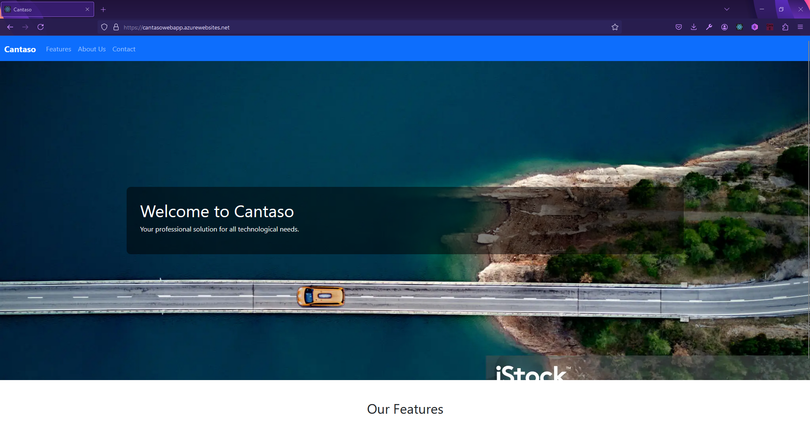

# Cantaso-Az-WebApp
An Azure Webapp with a very basic CICD



This project demonstrates how to deploy a Node.js application to an Azure Web App using Terraform for infrastructure provisioning and GitHub Actions for CI/CD.

## Prerequisites

Before you begin, ensure you have the following tools installed:

- [Terraform](https://www.terraform.io/downloads)
- [Node.js](https://nodejs.org/) (version 16 or later)
- [Git](https://git-scm.com/)

## Setup Instructions

### 1. Clone the Repository

```sh
git clone https://github.com/Betheval/Cantaso-Az-WebApp
cd Cantaso-Az-WebApp
```

### 2. Configure Azure Resources with Terraform

#### Initialize Terraform

```sh
terraform init
```
#### Apply Terraform Configuration

```sh
terraform apply
```
This will create an Azure Resource Group, an App Service Plan, and an Azure Web App.

### 3. Set Up GitHub Actions
#### Get the Azure Web App Publish Profile:
1. Go to your Azure Web App in the Azure Portal.
2. Click on "Get publish profile" and download the file.
#### Add Publish Profile to GitHub Secrets:
1. Go to your GitHub repository.
2. Navigate to Settings > Secrets and variables > Actions.
3. Add a new secret with the name AZURE_WEBAPP_PUBLISH_PROFILE.
4. Paste the content of the publish profile file.
5. Check my Github Action workflow


### 4. Deploy Your Application
Push your code to the main branch, this will trigger the GitHub Actions workflow and deploy your application to Azure.

### Cleanup
To remove all resources created by Terraform, run:
```sh
Terraform destroy
```


